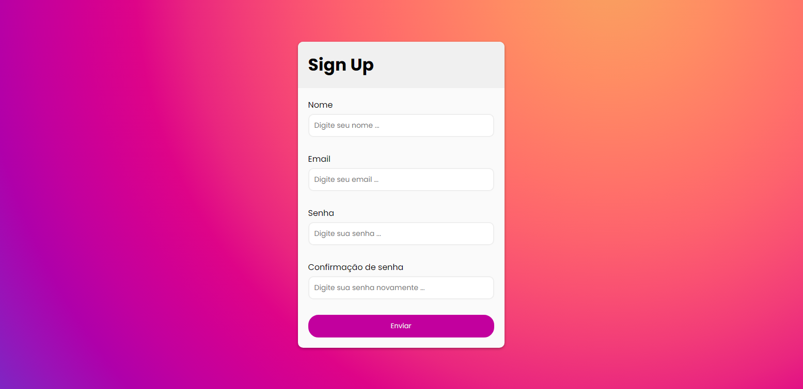
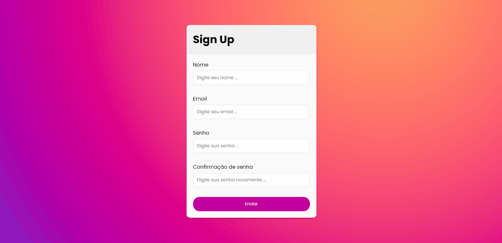

</img>
<h1>Project: Form With Validation</h1>

It is a form made with HTML, CSS and JS.
It contains validation and is responsive.

É um formulario feito com HTML, CSS e JS.
Ele contem validação e está responsivo.

  
</img>
</img>
<!-- 
Versão Mobile

</img>
 -->

Technologies Used

   <h2>HTML CSS JS</h2>

Made by my👨🏻‍💻

<button><a href="https://aesthetic-melba-f07be5.netlify.app">Access here</a></button>